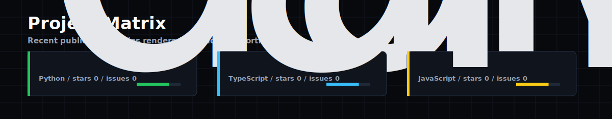
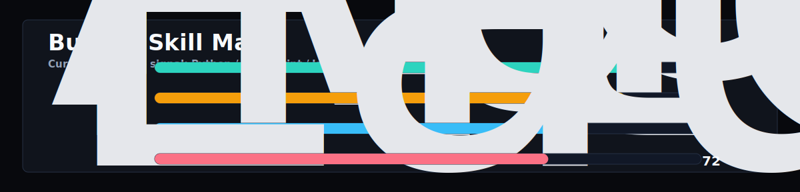

<h1 align="center">David Vuy</h1>

<p align="center">
  AI-native prototypes, automation systems, creative interfaces, and practical product launches.
</p>

<p align="center">
  
</p>

## Signal

This front page is generated like a small public command center. GitHub activity goes in; SVG systems come out.

<p align="center">
  
</p>

<p align="center">
  
</p>

## Builder Notes

| Zone | Focus |
| --- | --- |
| Product instinct | Build the smallest version that can be tried by a real person. |
| AI systems | Use models as workflow engines, evaluators, researchers, and interface material. |
| Interface taste | Prefer dense, clear, animated systems over generic landing-page gloss. |
| Launch filter | A project is not real until usage, feedback, legal basics, and payment path are considered. |

## Operating Loop

```txt
observe    repo, market, user, workflow, bottleneck
compress   turn the messy thing into one testable slice
build      ship a working version before decorating the theory
verify     run it, break it, measure it, simplify it
launch     make the next user action obvious
```

## Current Experiments

| Experiment | Status |
| --- | --- |
| Profile OS | Running here. Generates the visible front page from GitHub signals. |
| Project Matrix | Turns public repos into no-click visual portfolio cards. |
| Skill Map | Summarizes the current builder posture from public activity. |
| Next Layer | Generated case-study strips, launch scoreboard, and repo quest board. |

## Tech I Reach For

```bash
TypeScript  Python  React  Next.js  Node.js  GitHub Actions
SVG         CSS     Automation  AI APIs  Product thinking
```

## How This Page Updates

The workflow in `.github/workflows/ai-ecosystem.yml` runs on a schedule, on demand, and after profile changes. It writes the SVG assets in `assets/`, then commits the new profile state back into this repo.

Local preview:

```bash
python3 scripts/generate_ai_ecosystem.py --offline --owner davidvuy
open assets/ai-ecosystem.svg
```
