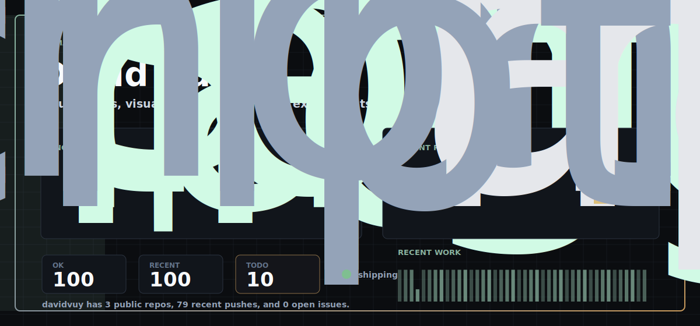
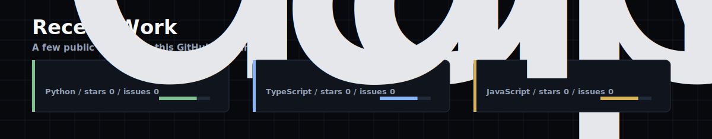
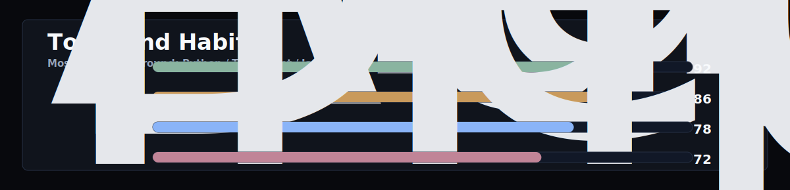

<h1 align="center">David Vuy</h1>

<p align="center">
  I build small useful things, test ideas quickly, and keep improving what works.
</p>

<p align="center">
  
</p>

## Hi

I'm David. I like building apps, visual interfaces, automation, and practical tools that can actually be used.

I care about getting from idea to working version fast, then making it cleaner once the shape is real.

<p align="center">
  
</p>

<p align="center">
  
</p>

## What I Like

| Area | What I mean |
| --- | --- |
| Apps | Simple tools with a clear reason to exist. |
| Interfaces | Screens that feel clean, quick, and a little different. |
| Automation | Repeated work that should not stay manual forever. |
| Product work | Making sure an idea can survive contact with real users. |

## How I Work

```txt
start small
make it work
try it honestly
remove what is fake
improve the part people actually use
```

## Tools

```bash
TypeScript  Python  React  Next.js  Node.js  GitHub Actions
SVG         CSS     APIs       Databases Product thinking
```

This profile updates itself from public GitHub activity. Local preview:

```bash
python3 scripts/generate_profile_assets.py --offline --owner davidvuy
open preview.html
```
