<h1 align="center">David Vuy</h1>

<p align="center">
  Building strange, useful, AI-native software systems.
  Fast prototypes, practical products, and interfaces that feel alive.
</p>

<p align="center">
  <picture>
    <source media="(prefers-color-scheme: dark)" srcset="assets/ai-ecosystem.svg">
    
  </picture>
</p>

## Current Signal

This profile is not a static poster. It has a small automation loop behind it:
GitHub activity goes in, a visual system comes out, and the front page changes
without anyone needing to click around.

| Mode | What it means here |
| --- | --- |
| Live profile world | The large SVG above is regenerated by GitHub Actions. |
| Activity scanner | Recent pushes, repos, issues, and workflow results are converted into mood, health, pressure, and motion. |
| No JavaScript needed | The animation is pure SVG/CSS, so it works directly on the GitHub profile page. |
| Optional AI layer | If an API key is added, the system can write its own short diagnosis of the profile state. |

## What I Like To Build

| Zone | Focus |
| --- | --- |
| AI product prototypes | Small tools that prove an idea quickly instead of staying theoretical. |
| Automation systems | Workflows that collect signals, make decisions, and produce useful output. |
| Creative interfaces | Dashboards, profile worlds, game-like UIs, and visual systems with personality. |
| Practical launch work | Turning experiments into something a real user could try, understand, and pay for. |

## Builder Operating System

```txt
input      messy idea, repo, workflow, market signal
process    prototype fast, test honestly, remove fake complexity
output     usable product slice, launch plan, automation, proof
style      playful front, practical engine, no empty theatre
```

## Active Front-Page Experiments

| Experiment | Status |
| --- | --- |
| Self-aware profile ecosystem | Running on this profile now. |
| GitHub signal renderer | Converts public GitHub data into an animated SVG. |
| No-click portfolio page | This README is designed to show the core story immediately. |
| Next layer | Add generated project cards, a commit soundtrack, or a small visual quest board. |

## Tech I Reach For

```bash
TypeScript  Python  React  Next.js  Node.js  GitHub Actions
SVG         CSS     Automation  AI APIs  Product thinking
```

## How This Page Updates

The workflow in `.github/workflows/ai-ecosystem.yml` runs on a schedule, on
demand, and after profile changes. It writes `assets/ai-ecosystem.svg` and
`assets/ecosystem-state.json`, then commits the new profile state back into this
repo.

Local preview:

```bash
python3 scripts/generate_ai_ecosystem.py --offline --owner davidvuy
open assets/ai-ecosystem.svg
```
