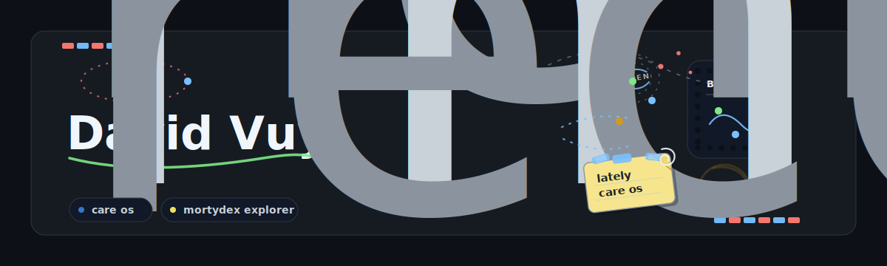
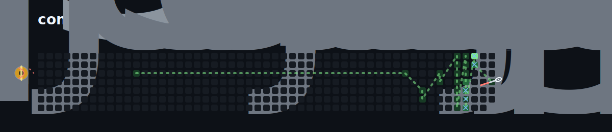

<h1 align="center">David Vuy</h1>

  Making apps, experiments, and weird little useful things.

  

  

I like turning loose ideas into something you can actually open, click, test, and improve.

Mostly building with TypeScript, Python, React, Next.js, Node.js, SVG, CSS, APIs, and GitHub Actions.

This README updates its small visuals from public GitHub activity.
